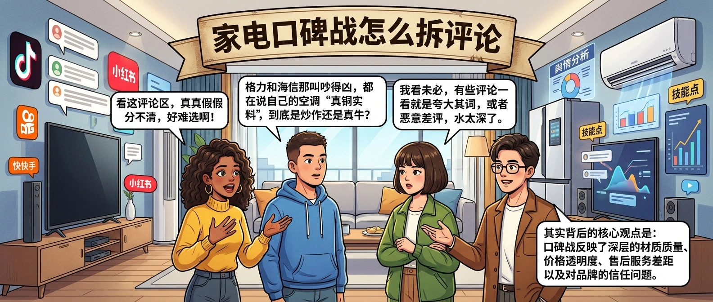
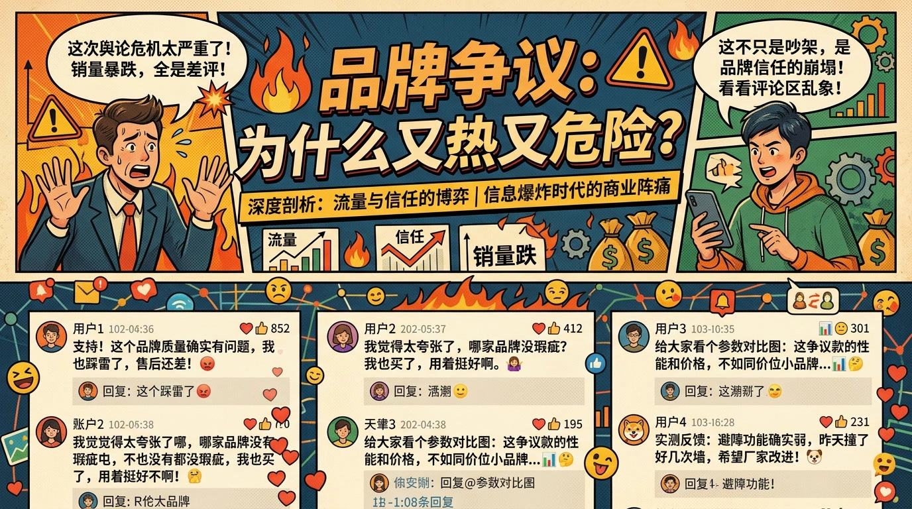
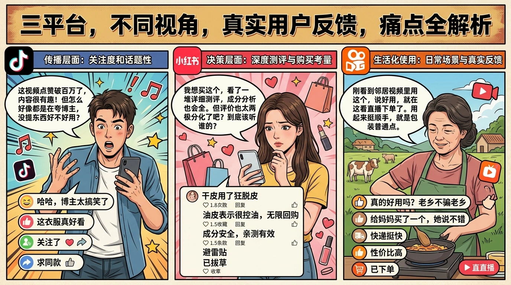
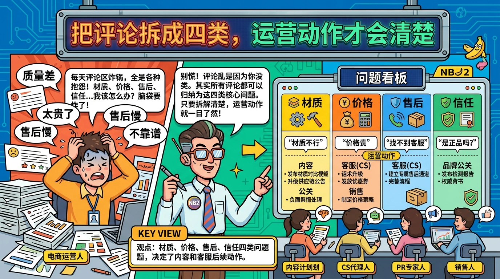

# 家电口碑战怎么拆评论

> `格力海信真铜实料之争背后` 这种品牌争议，一上热榜就很容易变成流量口。但对家电品牌、经销商和内容团队来说，真正有价值的不是蹭一句口水战，而是尽快看懂：用户到底在讨论参数真假、价格、售后，还是品牌信任。

## 品牌争议为什么又热又危险

家电争议类话题有一个典型特征：讨论速度很快，但用户判断并不稳定。

有人会被标题直接带着走，立刻转发；有人会开始翻参数、翻拆机、翻售后经历；还有人只是在评论区放大自己过去的不满。于是同一个热点里会混着三类声音：

- **情绪型声音**：骂品牌、站队、玩梗
- **信息型声音**：拿参数、材质、价格对比
- **经验型声音**：自己买过、装过、修过，开始讲具体使用体验

如果你只看播放量和点赞，很容易误判成“大家只关心争议本身”。实际上，真正会影响成交和品牌形象的，往往是后两类声音。

## 三个平台，三个不同问题层

评论舆情 skill 的价值，不在于单个平台的情感百分比，而在于**跨平台对照后的问题分层**。

### 抖音：看情绪和传播速度

抖音最适合观察的是话题有没有继续放大、用户第一反应偏愤怒还是偏调侃、哪类说法最容易被转发。

### 小红书：看决策前的细问

小红书评论更像“我真打算买，所以我要问清楚”。这里更容易看到：

- 值不值得买
- 同价位怎么选
- 安装、售后、噪音、耗电到底怎么样

### 快手：看更接地气的使用反馈

快手用户的评论里，经常能看到家庭使用、门店体验、农村或三四线城市购买习惯等更生活化的表达。这类反馈对家电尤其有价值，因为它离真实使用场景更近。

把三边放一起，你就能判断：这件事现在更像公关事件，还是更像真实购买阻力。

## 把评论拆成四类，运营动作才会清楚

家电争议话题跑完评论后，建议先别急着做总结，先把评论切成四类：

- **材质和参数质疑**：到底是不是“真铜实料”，是不是宣传过度
- **价格和价值感质疑**：这个价位值不值，贵在哪
- **售后和安装质疑**：买后体验到底好不好，维修和安装是否省心
- **品牌信任质疑**：用户是在怀疑这次争议，还是已经连品牌整体都不信了

拆完以后，动作会一下子清晰很多：

- 如果材质质疑最多，内容应优先做参数和拆解解释
- 如果价格质疑最多，优先做同档位比较和购买建议
- 如果售后质疑最多，优先让客服和门店准备统一答复
- 如果品牌信任质疑最多，说明这不是一条内容就能救的，需要更系统的口碑修复

评论不是拿来看热闹的，它应该直接决定你接下来发什么、回什么、卖什么。

## 争议热点怎么接，才不只剩情绪

面对这种品牌话题，一个更稳的执行顺序是：

1. 先用 `douyin-sentiment-dashboard` 跑出抖音主战场的情绪结构
2. 再选 1 到 2 条小红书笔记补 `xhs-sentiment-dashboard`
3. 如果产品偏大众家庭使用，再补 `kuaishou-sentiment-dashboard`
4. 把高频词和高频问题做成一张“争议问题板”
5. 内容、客服、销售三端共用这张板，不各说各话

最怕的是内容团队还在追热点，客服已经被问崩，销售又在说另一套。评论舆情真正值钱的地方，是它可以让三个团队看到同一份用户问题。

## FAQ

**Q：品牌争议是不是越快发声越好？**  
不一定。先把评论问题看清楚，比抢速度更重要。发得快但说不到点上，反而会二次放大争议。

**Q：只看一个平台可以吗？**  
可以起步，但很容易偏。抖音看传播、小红书看决策、快手看使用，三者各有偏重。

**Q：评论里负面多，是不是说明这波没法接？**  
不一定。负面多说明信任问题在放大，只要能及时把问题拆细并给出具体回应，反而有机会把抽象争议变成明确解释。

## 结论

家电口碑战最怕两种做法：一种是只会跟着吵，另一种是装作没看见。更有效的方法，是尽快把评论拆成“材质、价格、售后、信任”四层，然后让内容、客服、销售围绕同一份问题表动作。这样你接住的就不只是流量，还有用户真正的决策信息。
