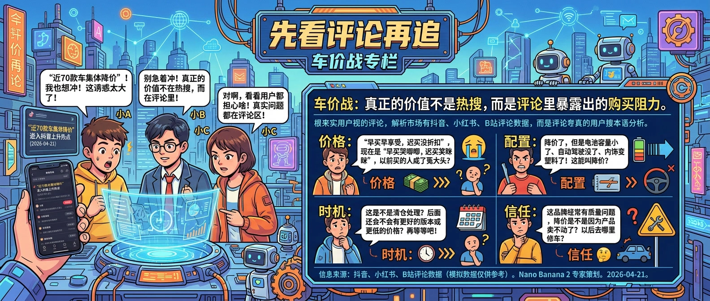
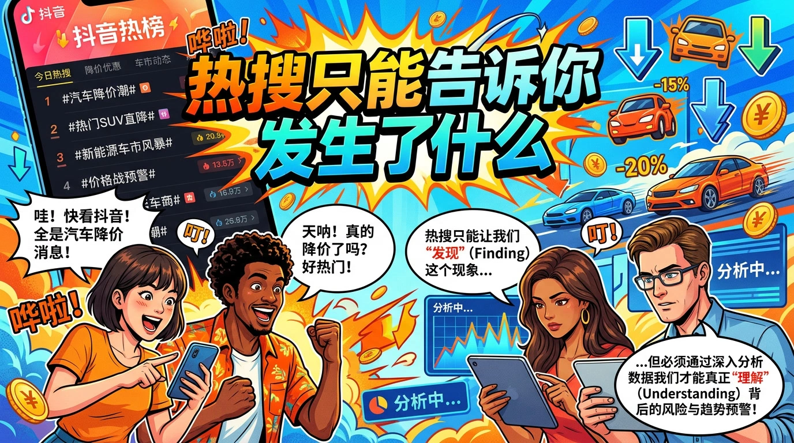
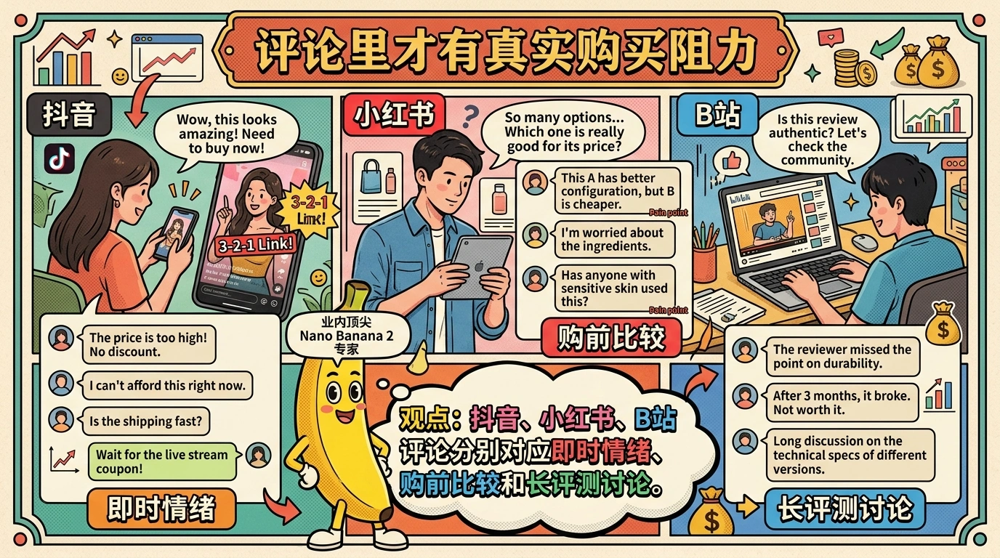
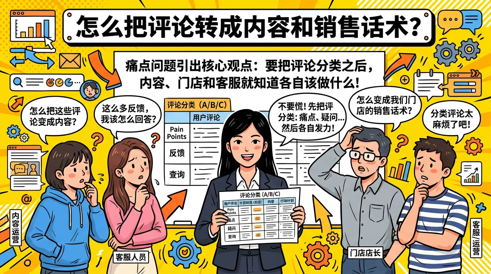

# 车价战先看评论再追

> 2026 年 4 月 21 日，`近70款车集体降价` 进入抖音上升热点。很多账号看到这种词就会立刻做热搜复述，但汽车内容真正值钱的不是“发生了降价”，而是用户在评论里到底在问什么、怕什么、卡在哪一步不下单。

## 热搜只能告诉你发生了什么

`douyin-hotlist-overall` 很适合做第一层预警。它能让你第一时间知道：

- 哪个话题正在平台放大
- 它是刚刚冒头，还是已经进入全民讨论
- 这个话题是否值得你开一个观察线程

但汽车赛道和娱乐赛道不一样。车价战不是一个靠“吃梗”就能转化的热点，它背后通常连着更具体的问题：

- 现在买会不会继续跌
- 低价版是不是减配了
- 金融政策有没有坑
- 老车主会不会背刺
- 这波降价是全国统一还是门店噱头

如果你只转发热搜，不回答这些问题，流量再大也很难沉淀成咨询和成交。

## 评论里才有真实购买阻力

评论舆情类 skill 在汽车话题里最有价值的地方，是它能帮你把“热闹”翻译成“购买阻力”。

一个很实用的组合是：

- **抖音评论舆情**：看第一反应，用户最直觉的情绪是兴奋、观望，还是“又来套路了”。
- **小红书评论舆情**：看更细的购前比较，用户会把配置、落地价、保险、售后一起放进讨论。
- **B站评论舆情**：看更长的理性讨论，尤其是测评视频下的配置对比和使用价值争论。

三类评论一对照，你基本就能分清：

1. 这是“价格刺激”驱动，还是“配置焦虑”驱动
2. 用户现在是在比品牌，还是在比具体车型
3. 大家最担心的是后续继续降，还是现在入手吃亏

这比单看播放量更能帮助门店、销售、内容团队判断下一条该发什么。

## 怎么把评论转成内容和销售话术

把评论跑完以后，不要只停留在“正负面比例”。真正有用的是把评论整理成 4 类问题清单：

- **价格问题**：到底便宜了多少，落地差多少
- **配置问题**：减没减配，哪个版本更划算
- **时机问题**：现在买还是再等等
- **信任问题**：门店会不会加价、金融会不会隐藏收费

然后你的内容和销售动作就很清晰了：

- 内容团队出“看降价热搜前先看这 3 个坑”
- 门店销售出“不同版本落地价对比表”
- 评论区置顶“本地政策、提车周期、金融方案”
- 私信承接只回答高频问题，不再重复人工解释

当一条热点能被拆成这四类问题，它就不是流量噪音，而是一条能被接住的需求线索。

## 一个够用的执行顺序

面对车价战，不要今天看到热搜、今天就拍情绪视频。更稳的顺序是：

1. 用 `douyin-hotlist-overall` 确认话题已经进入主榜或上升榜
2. 选 3 到 5 条高互动视频，分别跑 `douyin-sentiment-dashboard`
3. 再补 1 到 2 篇小红书笔记、1 条 B 站测评视频，分别跑 `xhs-sentiment-dashboard` 和 `bilibili-sentiment-dashboard`
4. 把评论按“价格 / 配置 / 时机 / 信任”分类
5. 最后再决定发解释型内容、比较型内容，还是门店咨询型内容

这个顺序的关键在于：**先看用户担心什么，再决定你怎么说。**

## FAQ

**Q：只看抖音评论不行吗？**  
不够。抖音更适合看即时情绪，小红书和 B 站更适合看理性决策和长讨论，三者缺一个都会让判断变偏。

**Q：评论负面很多，是不是不要追这个话题？**  
不一定。负面多往往说明用户有强问题要解决，只要你能给出更清楚的答案，反而容易接到咨询。

**Q：这个方法适合门店还是适合内容号？**  
两者都适合。门店拿来改话术，内容号拿来做选题，本质都是把热点翻译成真实需求。

## 结论

车价战热点不是不能追，而是不能只追热搜。热搜负责告诉你“现在该看这件事了”，评论舆情才负责告诉你“用户为什么还没买”。只要把这两层连起来，你做出来的内容和销售动作就会明显更贴近真实需求，而不是停留在转发一条大家都看过的新闻。
