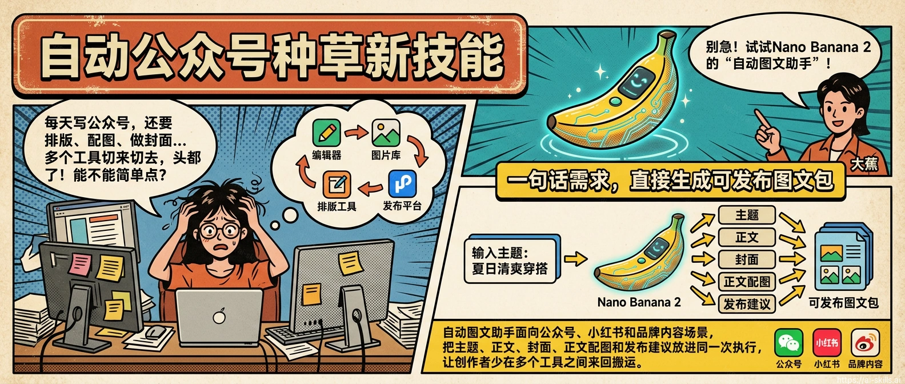
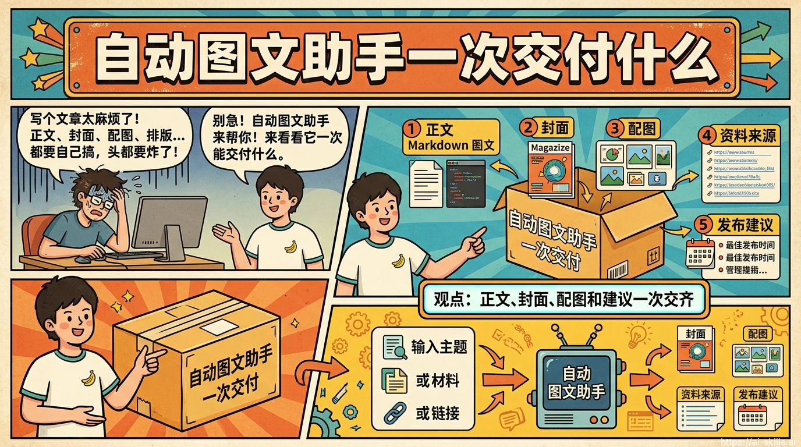
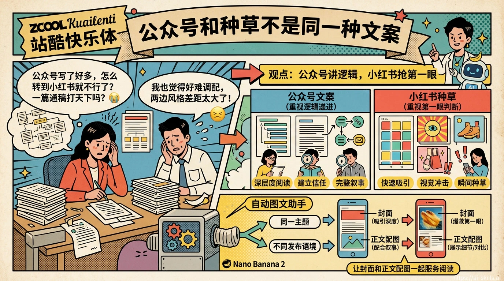
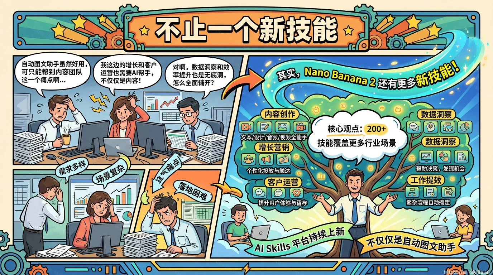

# 自动公众号种草新技能

> 如果你经常卡在“主题有了，但公众号正文、封面、小红书种草角度和配图还要分开做”，自动图文助手就是这次最值得先试的新技能。

## 内容创作者真正缺的不是灵感

很多人做公众号或小红书，最慢的地方不是想主题，而是把主题变成一套能发布的内容。正文要有结构，封面要适合平台，正文图要能解释观点，标题和发布建议还要跟渠道语气匹配。

于是一个简单选题常常被拆成五六个工具：先写大纲，再改正文，再找图，再做封面，再补小红书标题。每一步都不难，但每一步都会消耗判断力。

自动图文助手解决的就是这个断点。它不是只给一段文案，而是把“自动公众号文章”和“小红书种草文案”放进同一个图文生产流程里，让创作者从一句话需求开始，直接拿到更接近发布包的结果。

## 自动图文助手一次交付什么

自动图文助手的核心能力很直接：输入主题、材料或链接后，生成完整 Markdown 图文，并配套产出封面、正文配图、资料来源和发布建议。

这对公众号尤其有用。公众号文章需要有清楚标题、导语、章节结构和头图；如果正文里有观点对比、流程说明或产品场景，配图还要跟段落一起解释，而不是随便放一张装饰图。

对小红书种草也一样。小红书不只看正文，还看封面字、第一屏信息密度和用户能不能立刻判断“这条对我有用”。自动图文助手会把多平台比例纳入输出，减少临发布前才发现图片不合适的返工。

## 从一句话到一套发布包

一个典型用法是这样：你输入“帮我写一篇介绍新品咖啡机的公众号文章，顺便给小红书种草角度”，再补充目标人群、卖点、语气和平台约束。

技能会先把主题拆成文章结构，再生成正文草稿；然后根据章节挑选适合配图的位置，比如用户痛点、产品对比、步骤说明和购买理由；最后输出多比例封面和正文图。

更关键的是，产物不是孤立的几段文字，而是一套能继续编辑的文件：Markdown 正文、图片、结构化 meta 和发布建议。团队可以把它交给编辑复核，也可以继续拿去做二次排版。

## 公众号和种草不是同一种文案

公众号文章更重视逻辑递进。读者愿意停留，但需要你把问题讲透：为什么现在要关注这个主题，常见误区是什么，怎么判断是否适合自己。

小红书种草更重视第一眼判断。用户先看封面和标题，再决定要不要点进来；进来之后，也更关心“我能不能照着做”“这是不是我的场景”。

自动图文助手的价值在于，它不会把两个平台简单混成一篇万能文案，而是把同一个主题拆成不同发布语境：公众号负责讲清楚，小红书负责让人快速理解卖点，封面和正文配图则负责降低阅读门槛。

## 适合四类高频场景

第一类是个人内容创作者。你有选题，但不想每次都从空白文档开始，可以用它先生成一版有结构、有图、有发布建议的草稿。

第二类是品牌运营。新品介绍、活动预热、案例复盘、知识科普都需要稳定产出。自动图文助手能把品牌素材整理成更适合传播的图文结构。

第三类是知识博主。课程、方法论、行业观察往往需要解释复杂概念，正文配图可以帮助读者更快理解观点，而不是只靠长段文字硬撑。

第四类是新媒体团队。团队协作时，最怕每个人对“成稿”理解不一致。统一的图文包能让编辑、设计和运营围绕同一份产物继续加工。

## 不止一个新技能

自动图文助手只是这轮上新里最适合内容团队先试的一条。AI Skills 平台也在持续上新 200+ 技能和应用能力，覆盖内容创作、增长营销、客户运营、数据洞察、工作提效等更多行业场景。

这意味着你不必只从“我要写文章”开始找工具。你也可以从职业、行业或具体问题出发：比如卖家要做商品种草，运营要看评论反馈，管理者要整理汇报，客服团队要优化回复质量。

AI Skills 的方向不是把技能堆成清单，而是把不同岗位每天要交付的结果拆成可执行能力。自动图文助手负责内容生产这一步，其他技能会继续补上选题、审稿、分析、改稿和运营判断。

## 怎么开始用

如果你现在就想试，可以打开自动图文助手技能页，把主题、发布平台、目标读者和素材填进去。第一次不要追求一步到位，先让它生成一版完整图文包，再围绕你的品牌语气做人工复核。

建议从三个小任务开始：一篇公众号长文，一篇小红书种草笔记，一组适合复用的封面和正文配图。跑完这三件事，你基本就能判断它是不是适合放进自己的内容生产流程。

更多类似场景，也可以回到 AI Skills 的 Skills 应用场景列表继续看。内容创作、增长营销、数据洞察和客户运营会陆续补齐更多可直接上手的技能指南。

## 资料来源

1. [自动图文助手技能页](https://ai-skills.ai/zh/skills/ai-article?from=home)；AI Skills；访问日期：2026-05-19；用于核对技能名称、入口问题、主要用途和输出能力。
1. [AI Skills 应用场景](https://ai-skills.ai/zh/guides)；AI Skills；访问日期：2026-05-19；用于说明本文发布位置和更多场景文章入口。
1. [AI Skills 官网](https://ai-skills.ai/)；AI Skills；访问日期：2026-05-19；用于说明平台按技能、职业、行业和应用场景组织 AI 能力。
